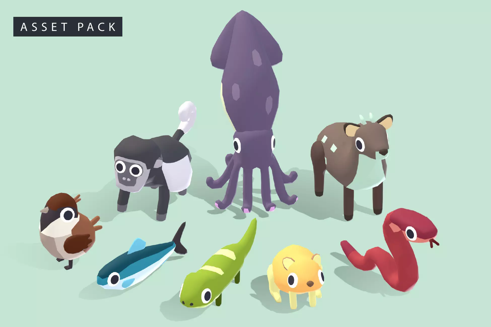

# Trach Racer with cute animals

This Unity project was created as a personal learning experience to grasp the fundamentals of Unity game development. It served as my playground to experiment with various aspects of Unity, understand the Unity interface, and get comfortable with different views and windows.

Here you can test out the outcome: https://play.unity.com/mg/other/webgl-11w

## What I Learned
During the development of this project, I focused on the following key areas:
- **Unity Interface:** I spent time getting familiar with Unity's interface, including the Scene view, Game view, Hierarchy, and Inspector panels.
- **Input Handling:** I used the old Input System to handle player input. This allowed me to understand how to capture and respond to keyboard and mouse inputs effectively.
- **Key Mapping:** Implementing key mapping for in-game actions was a crucial aspect of this project. I learned how to customize and manage input controls.
- **Sprites and Animations:** I worked with 3D sprites and used the Animator component to create animations. This involved importing sprites and setting up animation states.
- **Physics and Collision:** I utilized Unity's Capsule Collider and Rigidbody components to control object movement and handle collisions in a realistic way.

## Used Sprites
#### Quirky Series - FREE Animals Pack

https://assetstore.unity.com/packages/3d/characters/animals/quirky-series-free-animals-pack-178235
